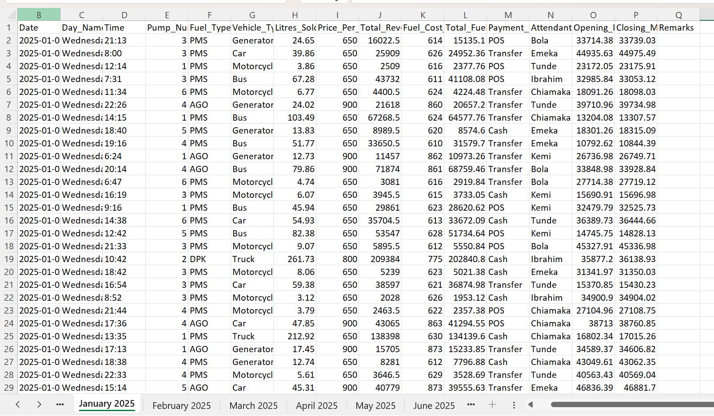
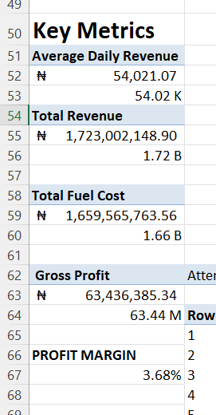
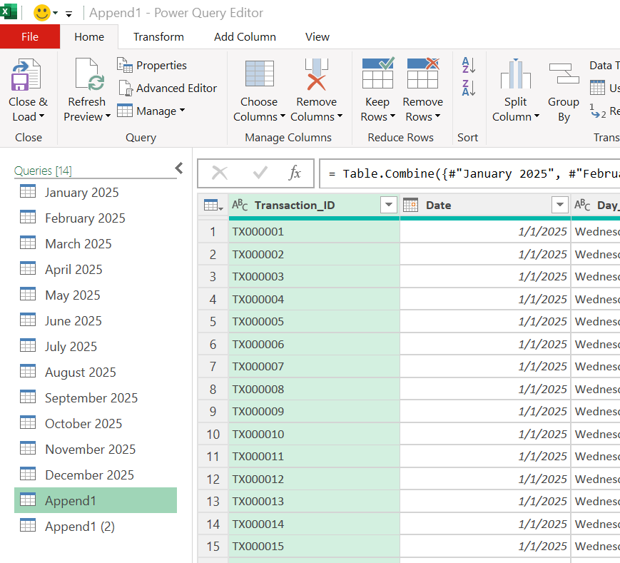
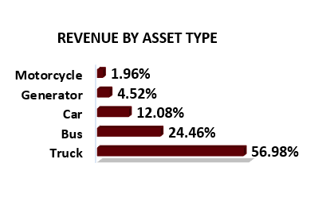
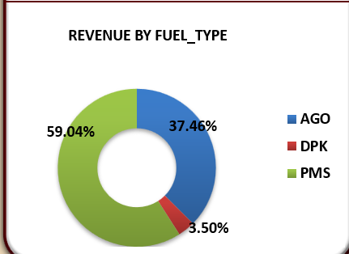
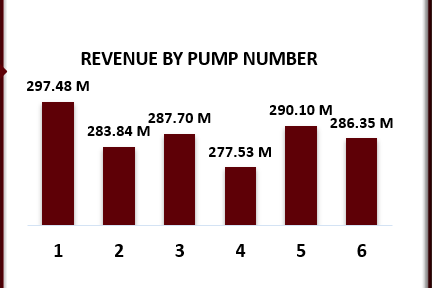
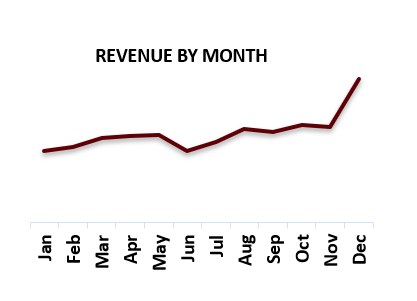
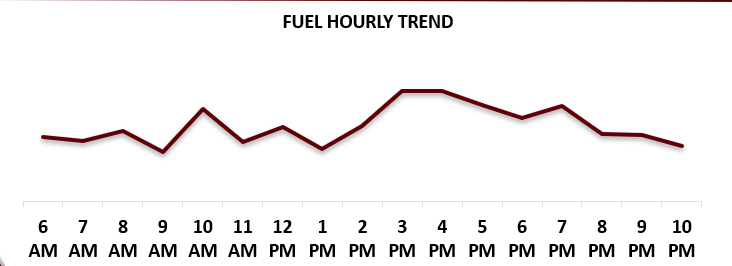
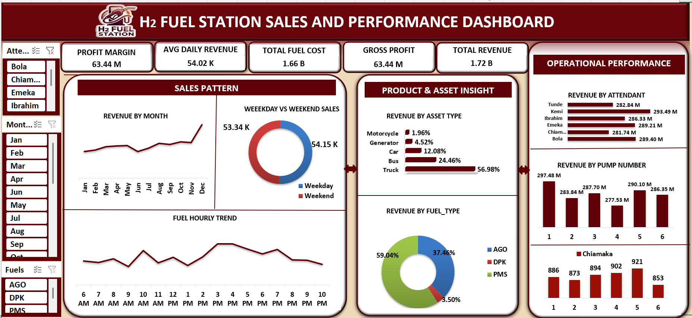

# H₂ FUEL STATION — SALES & PERFORMANCE ANALYSIS (2025)
---

# Table of Contents
---
- [Analysis Overview](#analysis-overview)
- [Problem Statement](#problem-statement)
- [Objectives](#objectives)
- [Data Source](#data-source)
- [Tools Used](#tools-used)
- [Data Preparation](#data-preparation)
- [Key Metrics Created](#key-metrics-created)
- [Skills Demonstrated](#skills-demonstrated)
- [Insights](#insights)
- [Recommendations](#recommendations)
- [Dashboard](#dashboard)
- [Conclusion](#conclusion)

---
## Analysis Overview

This project analyzes 31,896 fuel station transactions recorded throughout 2025 to identify revenue drivers, customer purchasing patterns, and operational performance. The dashboard was developed using Excel, Power Query, and Power Pivot to support data-driven business decisions.

---

## Problem Statement

Fuel stations generate thousands of transactions every day, making it challenging to understand which products, customer segments, and operations contribute most to revenue and profitability. This analysis addresses that challenge by uncovering key performance trends and operational opportunities.

---

## Objectives

- Analyze monthly and annual revenue performance.
- Identify the highest revenue-generating fuel products.
- Evaluate sales across customer segments.
- Determine peak sales hours and months.
- Assess pump and attendant performance.
- Compare weekday and weekend sales patterns.
- Evaluate overall profitability.
---
## Data Source

The dataset consists of **31,896 fuel station transactions** covering **January to December 2025**. The data was provided as **12 monthly Excel worksheets** and consolidated into a single dataset for analysis.

---
## Tools Used

- **Microsoft Excel** – Data analysis and dashboard development.
- **Power Query** – Consolidated monthly worksheets and performed data transformation.
- **Power Pivot** – Created calculated measures for KPI reporting.
- **Pivot Tables & Charts** – Built interactive dashboard visualizations.

---
## Key Metrics Created

The following metrics were created to evaluate business performance:

- **Total Revenue**
- **Gross Profit**
- **Total Fuel Cost**
- **Profit Margin**
- **Average Daily Revenue**

---
## Data Preparation

The dataset was prepared using Power Query by:

- Consolidating 12 monthly worksheets into a single dataset.
- Standardizing data types and formatting.
- Validating data quality and checking for duplicate records.
- Creating calculated columns to support time-based and profitability analysis.

---
## Skills Demonstrated

- Data Transformation and Consolidation (Power Query)
- Data Cleaning and Validation
- KPI Development and Performance Analysis
- Revenue and Profitability Analysis
- Customer Segmentation Analysis
- Operational Performance Analysis
- Time Series and Trend Analysis
- Dashboard Design and Data Visualization
- Data Storytelling and Business Recommendations
  
---
## Insights

The analysis uncovered several key trends related to customer behaviour, fuel demand, operational performance, and profitability. These findings highlight the station's major revenue drivers and areas where operational improvements can support better business performance.

---

### Insight 1 — Trucks are the station's largest revenue contributor

Trucks generate **56.98% of total revenue**, making them the station's highest-performing customer segment. Revenue is also highly concentrated in **PMS (59.04%)** and **AGO (37.46%)**, which together contribute **96.5% of total revenue**. This indicates that the station's financial performance depends heavily on these products and customers.

---

### Insight 2 — Pump 4 consistently records the lowest revenue

Pump 4 generated the lowest revenue among all six pumps throughout the year. Given that pumps typically operate under similar conditions, this consistent underperformance may indicate operational inefficiencies, equipment issues, or lower transaction volumes that require further investigation.

---

### Insight 3 — December and the 3–5 PM window are the station's busiest sales periods

December recorded the highest monthly revenue, reflecting increased fuel demand during the festive season. Daily sales also peak between **3 PM and 5 PM**, indicating periods of consistently high customer activity. In addition, **DPK sales show a noticeable increase between March and May**, suggesting seasonal demand patterns.

---

### Insight 4 — The station operates on a healthy but narrow profit margin

The station achieved a **gross profit margin of 3.68%**, which is typical for fuel retail businesses where margins are relatively low. At this level, maintaining operational efficiency is essential, as small improvements in inventory management, pump performance, and staffing can have a meaningful impact on overall profitability.

---
## Recommendations

### Prioritize High-Revenue Products and Customers

- Maintain adequate stock of PMS and AGO.
- Introduce loyalty programs for regular truck customers.
- Dedicate faster refuelling lanes for trucks customers.

### Improve Pump Performance

- Investigate the cause of Pump 4's low revenue.
- Check for operational or equipment issues.
- Review attendant assignments to identify possible performance gaps.

### Plan for Peak Demand

- Prepare fuel inventory ahead of the December demand surge.
- Ensure smooth operations during the 3–5 PM peak period.
- Plan staffing and fuel supply based on demand patterns.

### Expand Revenue Opportunities

- Introduce sales of engine oil, lubricants, and convenience store items.
- Focus on products with strong customer demand.
- Reduce dependence on low-performing product lines.

---
## Dashboard

---
## Conclusion

This analysis of 31,896 fuel station transactions
reveals that the station is performing at a normal
level but normal is not the ceiling.

Trucks and PMS are carrying the entire business.
Pump 4 is quietly underperforming. December and
the 3–5 PM window are peak periods that are not
being actively planned for. And a 3.68% margin
means there is very little room for operational
waste.

The good news: every one of these findings is
fixable. The data has already identified where
the opportunities are, the next step is acting
on them.

Data fuels better decisions.

---

Thank you for reading!

Connect with Me:

LinkedIn: [Peace Adaobi](https://www.linkedin.com/in/peace-ada-95b341341)  
Email: [peaceada100@gmail.com](mailto:peaceada100@gmail.com)

